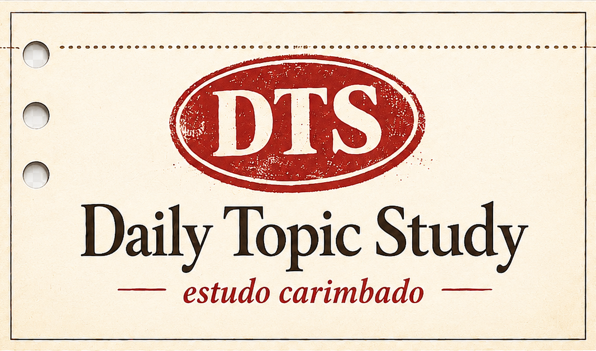

<div align="center">



# Daily Study Topic

</div>

Projeto de estudo que serve um tópico de programação aleatório por dia via API REST em Go, exibido num frontend estático com visual de "ficha de catálogo carimbada". Usado como playground para praticar CI/CD, deploy e arquitetura em camadas.

## O que faz

- Backend Go (Gin) expõe `GET /api/topic`, retornando um tópico aleatório (`id`, `title`, `difficulty`, `description`) vindo de um banco SQLite seedado.
- Frontend estático consome a API e renderiza o tópico num card; botão "Gerar novo tópico" busca outro aleatório.
- Pipeline de CI/CD com GitHub Actions: testes/build do backend, deploy no Render, deploy do frontend no GitHub Pages.

## Estrutura

```text
.
├── backend/    # API REST em Go (Gin + SQLite)
└── frontend/   # Frontend estático (HTML/CSS/JS)
```

Veja o README de cada pasta para detalhes de setup e arquitetura:

- [backend/README.md](backend/README.md)
- [frontend/README.md](frontend/README.md)

## Stack

### Backend
- Go
- Gin
- SQLite (`modernc.org/sqlite`, embed de schema/seed)

### Frontend
- HTML
- CSS
- JavaScript

## Aprendizado / objetivos do projeto

- CI/CD com GitHub Actions
- API REST em Go
- Deploy no Render
- Frontend estático no GitHub Pages
- Docker (futuramente)
